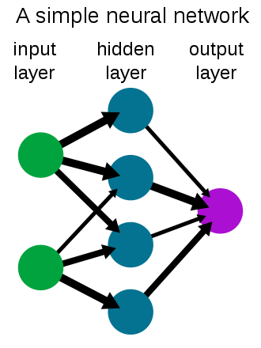

# External Resources
- [Rules of ML](https://developers.google.com/machine-learning/guides/rules-of-ml)
- [Neural Networks](https://en.wikipedia.org/wiki/Neural_network)
- [Dot Product Multiplication Demo](http://matrixmultiplication.xyz)
- [Cool YT Video about Tensors](https://www.youtube.com/watch?v=f5liqUk0ZTw)

# Fundamentals
- **Artificial Intelligence** - Intelligence shown by computers.
- **Machine Learning** - A subset of AI which is able to learn without explicit instructions, using algorithms and statistical informations.
- **Deep Learning** - A subset of ML which uses multiple layers of processing to extract higher levels of information from data

Machine Learning and AI is good because it helps us make computers do things hard to describe

## Programming vs Machine Learning Algorithms
Programming takes some Inputs and Rules, to create an Output

Machine Learning Algorithms takes Inputs and Expected Outputs, to get the Rules

A example of a Machine Learning Algorithm:-
We pass chest x-rays (Output) into ML Algorithms and it tells us if a person is infected with Covid-19 or not (Rules)

```md
Tip - ML can be used in literally anything if it can be converted into numbers
```

```md
Tip - If you can code a **SIMPLE** rule based system instead of an ML Algorithm, make the rule based system instead
```
## What Deep Learning is good for
1. Problems with long list of rules
2. Continously changing environments
3. Discovering things in large amounts of data

## What Deep Learning is bad for
1. When a human needs to understand the deep learning algorithm's patterns
2. When a simple rule based system is possible
3. When we cannot afford **ANY** errors
4. When you are lacking data (can usually be solved though) 

## Types of Data
- Structured Data is spread into rows and columns, like in an excel sheet
- Unstructured Data is raw data that has not been organised, for example images, social media posts, etc.

Usually ML Algorithms like Random Forest, Naive Bayes, etc. work better with Structured Data
and Deep Learning Algorithms like Neural Networks work better with Unstructured Data

*This can change depending on how we represent the problem.*

## Neural Networks
It is a network/circuit of neurons. These can be our braincells or artificial neurons in the computer.

```md
Neural Networks
├── Artificial Neural Networks
└── Biological Neural Networks
```
A neural network has an input layer which takes the data, multiple hidden layers which process the data and an output layer which outputs the data.



## Types of Learning
- Supervised - Has Labels
- Unsupervised - The AI labels the data on its own
- Transfer Learning - Using patterns from one deep learning model in another model
- Reinforcement Learning - Learning with awards
    - The award can be as simple as a score

## Types of Problems
- Classification - When we need to classify things
    - Binary Classification = two choices
    - Multi-class Classification = more than two choices

- Regression - Predicting a number

## Spliting of Data
Data is usually split into a training, validation and test set.
This can be compared to the course material, practice exam and final exam a school/tuition/college/university provides.

# What is a tensor?
A container which can house data in N-Dimensions

[Cool YT Video about Tensors](https://www.youtube.com/watch?v=f5liqUk0ZTw)

## Element-vise vs Dot Product Multiplication
### Element-vise
|     |     |     |     |     |     |      |      |
| --- | --- | --- | --- | --- | --- | ---- | ---- |
|  A  |  B  |  *  |  E  |  F  |  =  | A\*E | B\*F |
|  C  |  D  |     |  G  |  H  |     | C\*G | D\*H |

### Dot Product
|     |     |     |     |     |     |     |                    |                    |
| --- | --- | --- | --- | --- | --- | --- | ------------------ | ------------------ |
|  A  |  B  |  C  |     |  J  |  K  |     | A\*J + B\*L + C\*N | A\*K + B\*M + C\*O |
|  D  |  E  |  F  |  *  |  L  |  M  |  =  | D\*J + E\*L + F\*N | D\*K + E\*M + F\*O |
|  G  |  H  |  I  |     |  N  |  O  |     | G\*J + H\*L + I\*N | G\*K + H\*M + I\*O |


**3**, *3* <--> *3*, **2** --> **3**, **2**

Italic Numbers must match, resulting matrix pattern uses bold numbers

[Live Demo of Dot Product Multiplication](http://matrixmultiplication.xyz)

# Regression Problems
## Dependent an independent variables
When we try to solve a regression problem, we have some dependent or independent variables.

For example, when predicting the price of a house, independent variables may include number of rooms, beds, etc.
The price of our house is dependent on these variables, and is therefore a dependent variable.

The Output in a regression problem is the dependent variable and the inputs are the independent variables.
